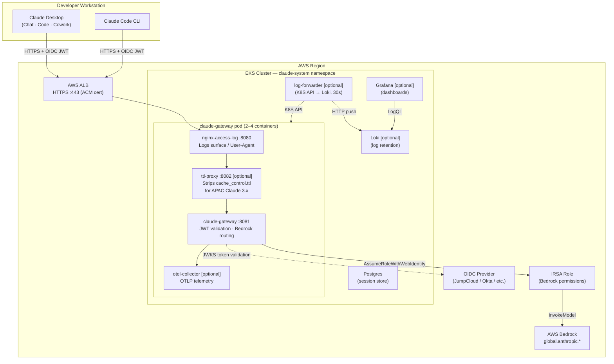

# Claude Apps Gateway on EKS — Runbook

**Gateway version:** 2.1.195  
**Last updated:** 2026-07-16

**References:**
- [Introducing Claude Apps Gateway for AWS](https://aws.amazon.com/blogs/machine-learning/introducing-claude-apps-gateway-for-aws/)
- [Claude Apps Gateway documentation](https://docs.anthropic.com/en/docs/claude-code/claude-apps-gateway)
- [Claude Code CLI documentation](https://docs.anthropic.com/en/docs/claude-code)

---

## Contents

1. [Architecture Overview](#1-architecture-overview)
2. [Prerequisites](#2-prerequisites)
3. [Initial Deployment](#3-initial-deployment)
4. [Post-Deploy Manual Steps](#4-post-deploy-manual-steps)
5. [Client Setup — Claude Desktop (macOS / Windows)](#5-client-setup--claude-desktop)
6. [Client Setup — Claude Code CLI](#6-client-setup--claude-code-cli)
7. [Verifying the Deployment](#7-verifying-the-deployment)
8. [Observability — Grafana & Loki](#8-observability--grafana--loki)
9. [Day-2 Operations](#9-day-2-operations)
10. [Troubleshooting](#10-troubleshooting)
11. [Destroy / Rebuild](#11-destroy--rebuild)

---

## 1. Architecture Overview



### Request flow

| Component | Role | Port |
|---|---|---|
| ALB | Internet-facing load balancer (ACM TLS cert) | 443 HTTPS |
| nginx-access-log | Logs User-Agent/surface, proxies inbound traffic | 8080 |
| ttl-proxy | Strips `cache_control.ttl` (APAC Claude 3.x compatibility) | 8082 |
| claude-gateway | Validates OIDC JWT, routes to Bedrock via IRSA | 8081 |
| otel-collector | Receives OTLP telemetry from CLI clients | 4317/4318 |
| Postgres | Gateway session store | 5432 |
| Loki | Log storage | 3100 |
| Grafana | Usage dashboards | 3000 |
| log-forwarder | Pushes gateway + nginx logs to Loki every 30s | — |

**Traffic path (all flags on):** `ALB → nginx:8080 → ttl-proxy:8082 → gateway:8081 → Bedrock`  
**Traffic path (`ttl_proxy_enabled = false`):** `ALB → nginx:8080 → gateway:8081 → Bedrock`

---

## 2. Prerequisites

### AWS

| Requirement | Details |
|---|---|
| AWS account | Bedrock enabled in your chosen region |
| Bedrock access | Request model access for Claude Sonnet, Haiku, Opus in the Bedrock console |
| IRSA | EKS OIDC provider configured; IRSA role with `bedrock:InvokeModel` permission |

### OIDC identity provider

Register an application in your OIDC provider (JumpCloud, Okta, Keycloak, Azure AD, etc.):

| Setting | Value |
|---|---|
| App type | Web Application (confidential client) |
| Redirect URI | `http://127.0.0.1/callback` |
| Grant types | Authorization Code + Refresh Token |
| Scopes | `openid email profile offline_access` |
| Token endpoint auth | `client_secret_post` |

Copy the **Client ID** and **Client Secret** into your tfvars.

### Domain and TLS certificate

You need a domain (e.g. `claude.yourcompany.com`) with a DNS-validated ACM certificate in the same region as your EKS cluster. Set `acm_certificate_arn` in tfvars — the ALB HTTPS listener attaches it automatically.

After `terraform apply`, create a Route53 CNAME:
```
claude.yourcompany.com → <ALB hostname from terraform output>
```

### Tools

```bash
terraform --version   # >= 1.6
kubectl version       # >= 1.28
aws --version         # AWS CLI v2
docker --version
helm version          # >= 3.x
```

---

## 3. Initial Deployment

### Step 1 — Build and push the gateway image

```bash
cd docker/claude-gateway

# Build and push to ECR (account ID and region are auto-detected from your AWS credentials)
./build-and-push.sh
```

### Step 2 — Configure tfvars

Copy `Terraform/environments/dev/terraform.tfvars.example` to `terraform.tfvars` and fill in your values:

```hcl
default = {
  project = "myorg"
  env     = "dev"
  region  = "us-east-1"
}

claude_gateway = {
  gateway_version  = "2.1.195"
  gateway_replicas = 1

  # Your domain — must resolve to the ALB (create Route53 CNAME after apply).
  gateway_hostname = "claude.yourcompany.com"

  # DNS-validated ACM certificate for your domain (same region as EKS cluster).
  acm_certificate_arn = "arn:aws:acm:<region>:<account-id>:certificate/<id>"

  bedrock_region    = "us-east-1"
  session_ttl_hours = 168

  # Generate with: openssl rand -hex 16
  # OIDC provider (JumpCloud, Okta, Keycloak, etc.)
  oidc_client_id     = "REPLACE_WITH_CLIENT_ID"
  oidc_client_secret = "REPLACE_WITH_CLIENT_SECRET"
  allowed_email_domain    = "yourcompany.com"

  grafana_admin_password = "REPLACE_WITH_STRONG_PASSWORD"  # required only if monitoring_enabled = true

  monitoring_enabled = true
  ttl_proxy_enabled  = true
}
```

### Step 3 — Apply

```bash
cd Terraform
terraform init
terraform apply -var-file=environments/dev/terraform.tfvars
```

Takes approximately 15–20 minutes. Creates: VPC, EKS cluster, all Kubernetes workloads, internet-facing ALB with your ACM certificate.

### Step 4 — Create Route53 CNAME

```bash
terraform output gateway_hostname
# e.g. k8s-myorg-xxx.us-east-1.elb.amazonaws.com
```

In Route53, create a CNAME record: `claude.yourcompany.com → <ALB hostname>`. DNS propagation typically takes 1–5 minutes.

---

## 4. Post-Deploy Manual Steps

```bash
# Update kubeconfig
aws eks update-kubeconfig --region <region> --name <cluster-name>

# Verify all pods are running
kubectl get pods -n claude-system
```

Expected with `monitoring_enabled = true`:
```
NAME                       READY   STATUS    RESTARTS
claude-gateway-<hash>      4/4     Running   0
grafana-<hash>             1/1     Running   0
log-forwarder-<hash>       1/1     Running   0
loki-<hash>                1/1     Running   0
postgres-<hash>            1/1     Running   0
```

If `monitoring_enabled = false`: only `claude-gateway` (2/2) and `postgres` appear.

---

## 5. Client Setup — Claude Desktop

### macOS

Edit the top variables in `scripts/setup-claude-desktop.sh` before running:

```bash
GATEWAY_URL="https://claude.yourcompany.com"
OIDC_CLIENT_ID="<your-oidc-client-id>"
OIDC_ISSUER="https://<your-oidc-issuer>"
OIDC_AUTH_URL="https://<your-oidc-issuer>/oauth2/auth"
OIDC_TOKEN_URL="https://<your-oidc-issuer>/oauth2/token"
ALLOWED_DOMAIN="yourcompany.com"
```

Then run:

```bash
bash scripts/setup-claude-desktop.sh
```

The script writes the managed plist at `/Library/Managed Preferences/com.anthropic.claudefordesktop.plist` and relaunches Claude Desktop. With a valid ACM certificate on your own domain, no manual certificate trust is required.

On first launch, a browser opens to your OIDC provider. After login, token refresh is silent.

#### Restore previous config

```bash
bash scripts/setup-claude-desktop.sh restore
```

---

### Windows

On Windows, Claude Desktop reads managed settings from the registry instead of a plist. Open **Registry Editor** (`regedit`) and create the following key and values, or run the PowerShell snippet below as Administrator:

**Registry path:** `HKLM:\SOFTWARE\Policies\Anthropic\ClaudeForDesktop`

```powershell
$oidc = @{
    clientId         = "<your-oidc-client-id>"
    issuer           = "https://<your-oidc-issuer>"
    authorizationUrl = "https://<your-oidc-issuer>/oauth2/auth"
    tokenUrl         = "https://<your-oidc-issuer>/oauth2/token"
    bearerTokenType  = "access_token"
    scopes           = "openid email profile"
    appendOfflineAccess = $true
} | ConvertTo-Json -Compress

$regPath = "HKLM:\SOFTWARE\Policies\Anthropic\ClaudeForDesktop"
New-Item -Path $regPath -Force | Out-Null
Set-ItemProperty -Path $regPath -Name "inferenceProvider"        -Value "gateway"
Set-ItemProperty -Path $regPath -Name "inferenceGatewayBaseUrl"  -Value "https://claude.yourcompany.com"
Set-ItemProperty -Path $regPath -Name "inferenceGatewayOidc"     -Value $oidc
Set-ItemProperty -Path $regPath -Name "chatTabEnabled"           -Value 1 -Type DWord
```

Restart Claude Desktop after applying. On first launch, a browser opens to your OIDC provider.

---

### Managed settings reference

| Key | macOS (plist) | Windows (registry) | Description |
|---|---|---|---|
| `inferenceProvider` | String `gateway` | REG_SZ `gateway` | Enables enterprise gateway mode |
| `inferenceGatewayBaseUrl` | String URL | REG_SZ URL | Gateway endpoint |
| `inferenceGatewayOidc` | JSON string | REG_SZ JSON string | OIDC configuration |
| `chatTabEnabled` | Boolean `true` | REG_DWORD `1` | Enables Chat (Beta) surface |

---

## 6. Client Setup — Claude Code CLI

```bash
./scripts/switch-claude-code-to-gateway.sh
claude /login
```

The browser opens to your OIDC provider. The CLI stores the session token and re-authenticates when it expires.

To switch back to direct Bedrock:

```bash
./scripts/switch-claude-code-to-bedrock.sh
```

---

## 7. Verifying the Deployment

```bash
# Health check
curl -sk https://<gateway-hostname>/healthz
# Expected: ok

# End-to-end inference
curl -s https://<gateway-hostname>/v1/messages \
  -H "Authorization: Bearer $TOKEN" \
  -H "Content-Type: application/json" \
  -H "anthropic-version: 2023-06-01" \
  -d '{
    "model": "claude-sonnet-4-6",
    "max_tokens": 20,
    "messages": [{"role": "user", "content": "say hello"}]
  }'

# Logs flowing to Loki (if monitoring_enabled = true)
kubectl logs -n claude-system -l app=log-forwarder | grep "pushed"
```

Grafana: `https://<gateway-hostname>/grafana` — credentials from `grafana_admin_password` tfvar.

---

## 8. Observability — Grafana & Loki

### Dashboard panels

| Panel | What it shows |
|---|---|
| Total Requests | Count in last 5 minutes |
| Avg Latency | Mean response time (ms) |
| Active Users | Distinct user count (last 1h) |
| Error Rate | % of 4xx/5xx responses |
| Requests per User | Per-email breakdown |
| Surface Breakdown | chat / code / cowork / cli |
| Surface Usage Over Time | Timeseries |
| Complete Logs | Raw log viewer — filter by container |

### Key Loki queries

```logql
# All inference events
{job="claude-gateway"} | json | evt="inference"

# By surface
{job="gateway-access"} | json | path="/v1/messages" | surface="cowork"

# Requests by user
sum by (email)(count_over_time({job="claude-gateway"} | json | evt="inference" [5m]))

# Error rate
{job="claude-gateway"} | json | evt="inference" | status > 399
```

### Real-time log tailing

```bash
kubectl logs -n claude-system deployment/claude-gateway -c claude-gateway -f
kubectl logs -n claude-system deployment/claude-gateway -c nginx-access-log -f
```

---

## 9. Day-2 Operations

### Scale gateway replicas

```hcl
# terraform.tfvars
claude_gateway = { gateway_replicas = 2 }
```

```bash
terraform apply -var-file=environments/dev/terraform.tfvars \
  -target=module.claude_gateway.kubernetes_deployment.claude_gateway
```

### Upgrade gateway version

```bash
cd docker/claude-gateway && ./build-and-push.sh 2.1.196
# Update gateway_version in tfvars, then:
terraform apply -var-file=environments/dev/terraform.tfvars \
  -target=module.claude_gateway.kubernetes_deployment.claude_gateway
```

### Add model aliases

Edit `models = [...]` in `Terraform/modules/claude-gateway/main.tf`:

```hcl
{ id = "my-alias", upstream_model = { bedrock = "global.anthropic.claude-sonnet-4-6" } },
```

```bash
terraform apply -var-file=environments/dev/terraform.tfvars \
  -target=module.claude_gateway.kubernetes_config_map.claude_gateway
kubectl rollout restart deployment/claude-gateway -n claude-system
```

### Check available APAC inference profiles

```bash
aws bedrock list-inference-profiles --region <region> \
  --query 'inferenceProfileSummaries[?contains(inferenceProfileId,`apac`)].{id:inferenceProfileId,status:status}' \
  --output table
```

---

## 10. Troubleshooting

### Inference returns 403

IRSA misconfigured or Bedrock model access not enabled in the console.

```bash
kubectl logs -n claude-system deployment/claude-gateway -c claude-gateway | grep "403\|denied"
aws bedrock list-foundation-models --region <region> --by-provider anthropic --output table
```

### Gateway pod not starting

```bash
kubectl describe pod -n claude-system -l app=claude-gateway
kubectl logs -n claude-system deployment/claude-gateway -c claude-gateway --previous
```

| Symptom | Cause | Fix |
|---|---|---|
| `ImagePullBackOff` | ECR image missing | Rebuild and push image |
| `Expected array, received object` in models | `models:` must be an array | Fix Terraform config |
| Gateway not validating tokens | Wrong OIDC issuer URL | Check `oidc_client_id` / issuer in tfvars |

### 400 from APAC Claude 3.x models

The ttl-proxy sidecar handles this automatically. Verify it is running and routing:

```bash
kubectl logs -n claude-system deployment/claude-gateway -c ttl-proxy | grep "Stripped"
kubectl exec -n claude-system deployment/claude-gateway -c nginx-access-log -- \
  grep proxy_pass /etc/nginx/nginx.conf
# Must show: proxy_pass http://127.0.0.1:8082;
```

If the issue persists with Claude 4.x models only, set `ttl_proxy_enabled = false` and re-apply to remove the hop.

### No logs in Grafana

```bash
kubectl logs -n claude-system -l app=log-forwarder | grep "pushed"
kubectl exec -n claude-system deployment/loki -- wget -qO- http://127.0.0.1:3100/ready
```

### Models not loading in Desktop

```bash
rm -f ~/Library/Application\ Support/Claude-3p/fcache
osascript -e 'quit app "Claude"' && open -a Claude
```

### "Couldn't start this task" in Cowork or Chat

Host-credentials session token expired. Try **Cmd+Q + relaunch** before investigating the gateway.

---

## 11. Destroy / Rebuild

> **Warning:** Permanently deletes all infrastructure and data.

```bash
# 1. Remove ALB first (prevents orphaned resources)
kubectl delete ingress claude-gateway -n claude-system
sleep 60

# 2. Remove persistent storage
kubectl delete pvc postgres-data loki-data grafana-data -n claude-system

# 3. Destroy
cd Terraform
terraform destroy -var-file=environments/dev/terraform.tfvars
```

After rebuild: follow Section 3 from the beginning. Re-run `setup-claude-desktop.sh` on each Mac (cert fingerprint changes on every rebuild).
